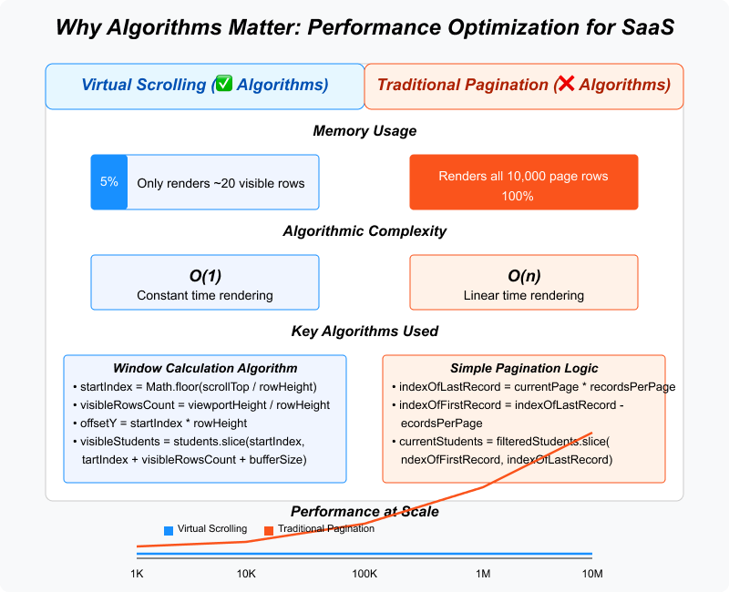

# CRUD×DSA: Comparing Algorithm Implementations

This repository demonstrates the impact of data structures and algorithms on CRUD application performance through two implementations of a Student Records Viewer application.

## Live Demos
- **DSA-Optimized Version**: [crudxdsa-dsa.netlify.app](https://crudxdsa-dsa.netlify.app)
- **Basic Implementation**: [crudxdsa-basic.netlify.app](https://crudxdsa-basic.netlify.app)


## Why Algorithms Matter: Performance Optimization


The repository compares two approaches to implementing the same functionality:

### Virtual Scrolling (✓ Algorithms)
- **Memory Usage**: Only renders ~20 visible rows (5%)
- **Algorithmic Complexity**: O(1) - Constant time rendering
- **Key Algorithms**:
  - Window Calculation Algorithm
    - startIndex = Math.floor(scrollTop / rowHeight)
    - visibleRowsCount = viewportHeight / rowHeight
    - offsetY = startIndex * rowHeight
    - visibleStudents = students.slice(startIndex, startIndex + visibleRowsCount + bufferSize)
- **Performance**: Scales efficiently with data size

### Traditional Pagination (✗ Algorithms)
- **Memory Usage**: Renders all 10,000 page rows (100%)
- **Algorithmic Complexity**: O(n) - Linear time rendering
- **Implementation**:
  - Simple Pagination Logic
    - indexOfLastRecord = currentPage * recordsPerPage
    - indexOfFirstRecord = indexOfLastRecord - recordsPerPage
    - currentStudents = filteredStudents.slice(indexOfFirstRecord, indexOfLastRecord)
- **Performance**: Performance degrades as data size increases

## Implementation Details

### DSA-Optimized Version
- Uses efficient data structures for faster search and filtering
- Implements virtual scrolling for memory optimization
- Utilizes indexed searching and hash-based filtering
- Applies advanced sorting algorithms
- Implements binary search for quick lookups

### Basic Implementation
- Uses straightforward array operations
- Implements traditional pagination
- Performs linear searches
- Uses basic array filtering
- Applies simple sorting techniques

The DSA-optimized version significantly outperforms the basic implementation in the following areas:
- Rendering large datasets
- Search operations
- Filtering operations
- Sorting large collections
- Memory efficiency

## When to Choose Each Approach

### Choose the DSA-Optimized Approach When:
- Working with large datasets (10,000+ records)
- Performance is critical
- Search and filter operations are frequent
- System memory is limited
- User experience requires smooth scrolling through large datasets

### Choose the Basic Approach When:
- Working with small datasets (< 1,000 records)
- Simplicity and maintainability are priorities
- Search and filter operations are infrequent
- Development speed is more important than optimization
- Application requirements are likely to change frequently

## Conclusion

The DSA-optimized version significantly improves performance for search and filter operations at the cost of increased implementation complexity. The choice between these approaches should be based on:

1. Dataset size
2. Operation frequency patterns
3. Performance requirements
4. Available system resources
5. Development timeline and resources

For most small-to-medium applications, the basic CRUD implementation provides sufficient performance with simpler maintenance. For applications dealing with large datasets or requiring frequent searches, the DSA-optimized version offers substantial performance benefits.

## Getting Started

To run either version locally:

```bash
# Clone the repository
git clone https://github.com/ahmmedsabbirbd/crudxdsa.git

# Navigate to the desired implementation
cd crudxdsa/basic  # & crudxdsa/dsa

# Install dependencies
npm install

# Start the development server
npm start
```
